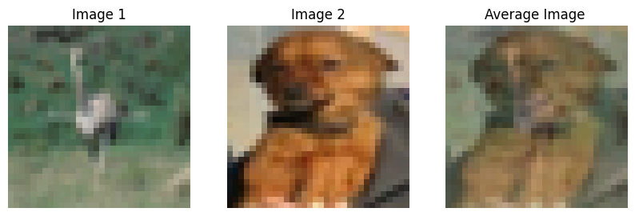
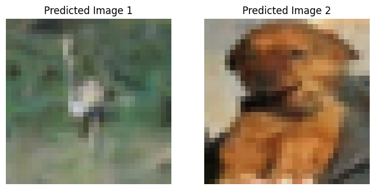
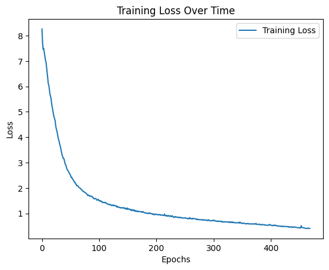

# CIFAR10 UNET Image Reconstruction

This repository contains a PyTorch implementation of a UNET model that reconstructs two images from their averaged sum. Using the CIFAR-10 dataset, the model takes two randomly selected images, computes their pixel-wise average, and then uses a UNET architecture to reconstruct the original images from this averaged sum.

## Table of Contents
- [Overview](#overview)
- [Installation](#installation)
- [Usage](#usage)
- [Model Architecture](#model-architecture)
- [Results](#results)
- [License](#license)

## Overview

The goal of this project is to demonstrate the capability of a UNET-based architecture in reconstructing images from their averaged sum. The model is trained on pairs of images from the CIFAR-10 dataset. These images are averaged, and the task of the UNET model is to reconstruct the original images from the average.

The dataset is split into two subsets:
- **Subset 1**: Classes 0 to 4 (e.g., airplane, automobile, etc.)
- **Subset 2**: Classes 5 to 9 (e.g., bird, cat, etc.)

The model is trained to reconstruct one image from each subset.

## Installation

1. Clone this repository:
    ```bash
    git clone https://github.com/your-username/CIFAR10_UNET_Image_Reconstruction.git
    ```
2. Install the required dependencies:
    ```bash
    pip install -r requirements.txt
    ```

## Usage

1. Prepare the CIFAR-10 dataset:
   The dataset will be downloaded automatically through the PyTorch `torchvision.datasets` API when running the script.

2. Run the training script:
    ```bash
    python unet_cifar10_reconstruction.py
    ```

3. After training, the model will evaluate its performance on the test set and plot the reconstruction results.

4. **Testing the Model:**
    Once trained, you can visualize the predictions by running the final section of the script, which displays original, averaged, and reconstructed images.

## Model Architecture

The UNET model consists of an encoder and two separate decoders. The encoder compresses the input (averaged image), while the decoders reconstruct the two original images.

- **Encoder**: Series of convolutional layers followed by max pooling.
- **Two Decoders**: Each decoder uses transpose convolutions and skip connections to reconstruct one of the original images.
- **Loss Function**: Mean Squared Error (MSE) between the predicted and original images.

Here is the basic structure of a UNET model:


## Results

Here are the results of the reconstruction:

### Original Images and Averaged Image



### Predicted Images from the UNET



### Training Loss Plot



## License

This project is licensed under the MIT License. See the [LICENSE](LICENSE) file for more details.
